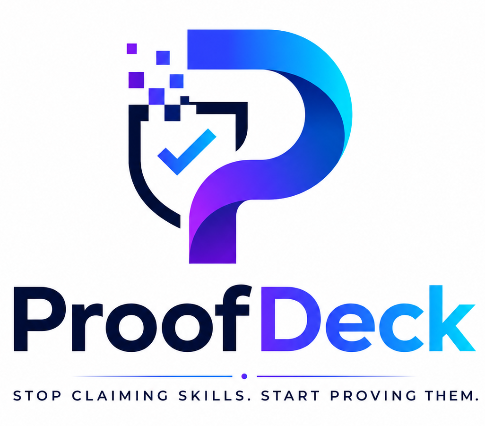
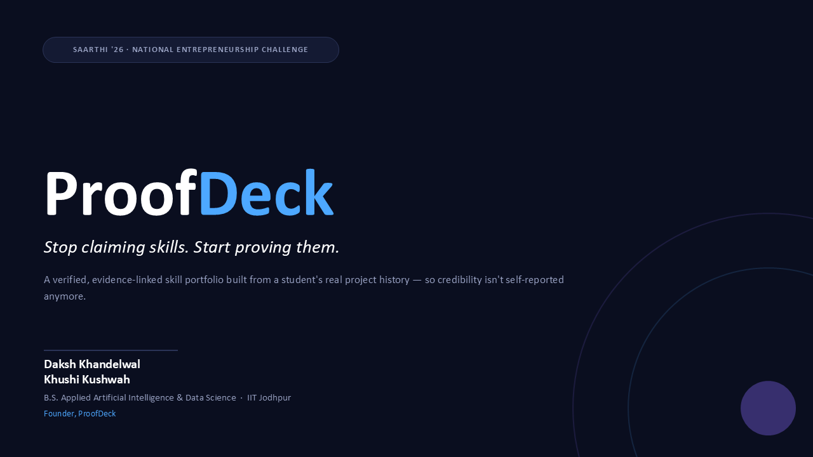
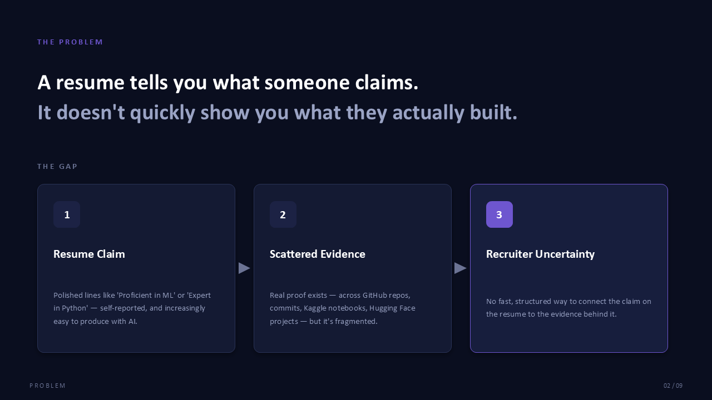
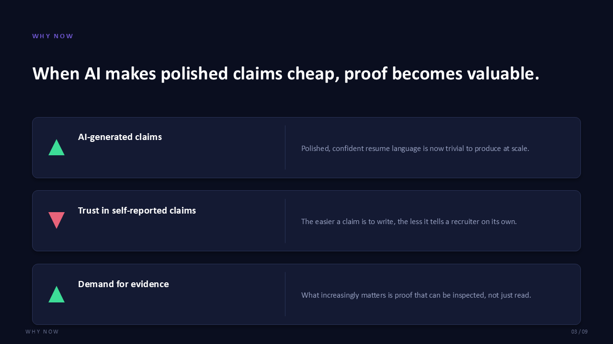
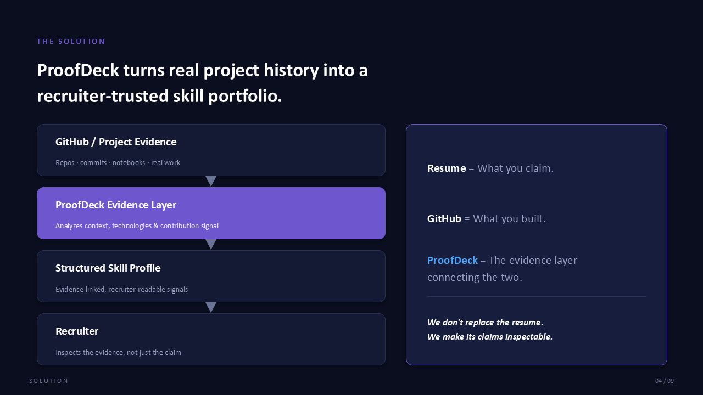
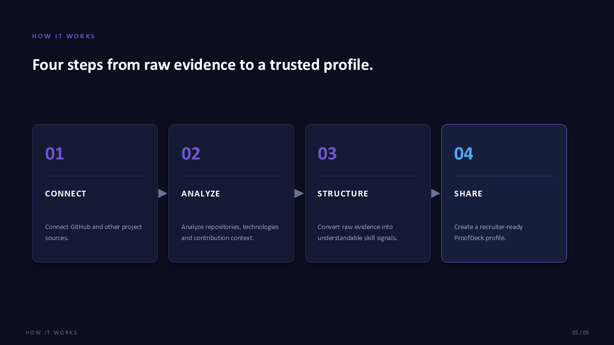
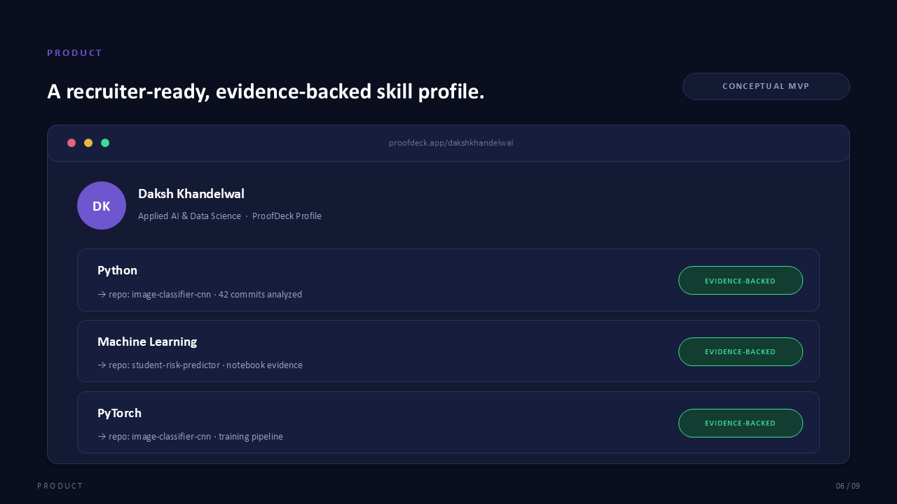
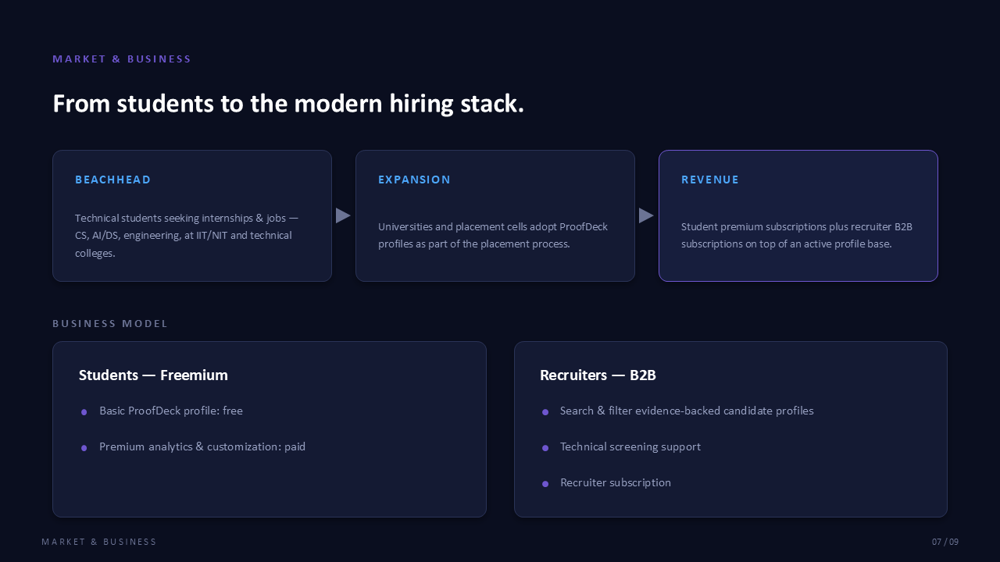
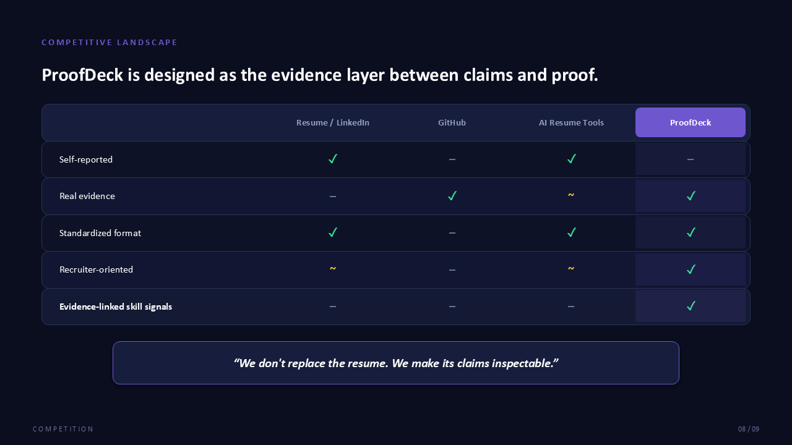
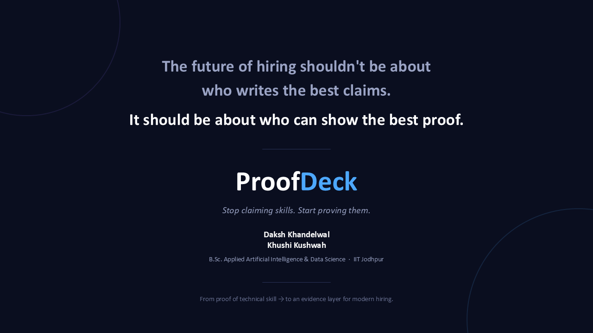

<div align="center">



# ProofDeck

### Stop claiming skills. Start proving them.

ProofDeck is a concept for an evidence-backed skill portfolio that connects a student's real project history with the skills they claim on their resume.

`Competition Project` · `Startup Concept` · `IIT Jodhpur` · `AI & Data Science`

</div>

---

## 1. The Problem

A resume communicates what a candidate **claims**. The real technical evidence behind those claims — commits, repositories, notebooks, projects — lives scattered across GitHub, Kaggle, and Hugging Face. Recruiters have no fast, structured way to connect a resume line like *"Proficient in ML"* to the actual work behind it.

**Why now?**
> Generative AI makes polished, confident resume language trivial to produce at scale. As self-reported claims get easier to write, they tell recruiters less on their own — which makes inspectable, evidence-based proof more valuable, not less.

---

## 2. The Idea

ProofDeck is designed around a simple positioning:

| | |
|---|---|
| **Resume** | What you claim |
| **GitHub** | What you built |
| **ProofDeck** | The evidence layer connecting the two |

The product concept is to transform a student's raw project history into structured, **evidence-linked skill signals** — not to certify or perfectly measure someone's ability, but to make existing claims easier to inspect and trust.

---

## 3. How It Works

<div align="center">

| Step | Stage | Description |
|:---:|---|---|
| 01 | **Connect** | Connect GitHub and other project sources |
| 02 | **Analyze** | Analyze repositories, technologies, and contribution context |
| 03 | **Structure** | Convert raw evidence into understandable skill signals |
| 04 | **Share** | Create a recruiter-ready ProofDeck profile |

</div>

```
GitHub / Project Evidence  →  ProofDeck Evidence Layer  →  Structured Skill Profile  →  Recruiter
```

---

## 4. Product / MVP

The proposed MVP flow:

```
Public GitHub profile/username
        ↓
   Repository & commit analysis
        ↓
   Evidence-backed skill profile
        ↓
   Shareable ProofDeck page
```

> **Note:** The product interface shown in the pitch deck (e.g. `proofdeck.app/dakshkhandelwal`) is a **conceptual MVP mockup** created for the pitch, not a deployed or functioning application. Any repository names, commit counts, or profiles shown are illustrative examples, not real product output.

---

## 5. Key Features

**Concept / MVP stage**
- Evidence-linked skill profiles generated from public repository data
- Repository and commit-history analysis
- Technology and contribution-context signals
- Recruiter-readable, standardized skill summaries
- Shareable candidate profile link

**Proposed future features**
- Integrations with Kaggle, Hugging Face, and GitLab
- Recruiter-side search and filtering tools
- Deeper contribution-quality signals beyond commit counts

---

## 6. Target Users

| Segment | Description |
|---|---|
| **Primary** | Technical students seeking internships and jobs |
| **Secondary** | Recruiters and hiring teams involved in technical screening |
| **Future** | Universities, placement cells, bootcamps, and broader credentialing ecosystems |

---

## 7. Business Model

<table>
<tr>
<td width="50%" valign="top">

**Student — Freemium**
- Basic ProofDeck profile: free
- Premium analytics & customization: paid

</td>
<td width="50%" valign="top">

**Recruiter — B2B**
- Evidence-backed candidate discovery
- Search & filtering
- Technical screening support

</td>
</tr>
</table>

> Pricing and monetization details are proposed only and have **not yet been validated**.

---

## 8. Competitive Positioning

| | Resume / LinkedIn | GitHub | AI Resume Tools | **ProofDeck** |
|---|:---:|:---:|:---:|:---:|
| Self-reported | ✅ | ❌ | ✅ | ❌ |
| Real evidence | ❌ | ✅ | ~ | ✅ |
| Standardized format | ✅ | ❌ | ✅ | ✅ |
| Recruiter-oriented | ~ | ❌ | ~ | ✅ |
| Evidence-linked skill signals | ❌ | ❌ | ❌ | ✅ |

> **"We don't replace the resume. We make its claims inspectable."**

This table reflects the intended positioning of the concept, not a verified competitive audit.

---

## 9. Validation Status

This is an **idea-stage competition project**. No user or recruiter validation has been conducted yet.

**Current status:** Concept / MVP stage

**Validation planned:**
- Student interviews on resume/portfolio pain points
- Recruiter interviews on technical screening workflows
- MVP build and limited profile-generation testing
- Sharing and usage measurement
- Recruiter feedback on evidence-backed profiles

---

## 10. Roadmap

> Proposed roadmap — not a committed delivery timeline.

| Phase | Focus |
|---|---|
| **Phase 1 — MVP** | GitHub-based evidence analysis |
| **Phase 2 — Multi-source evidence** | Kaggle, Hugging Face, GitLab, and other project sources |
| **Phase 3 — Recruiter layer** | Search, filtering, and screening tools |
| **Phase 4 — Institutional adoption** | Universities and placement cells |

---

## 11. Pitch Deck

The full Saarthi '26 Round 1 pitch deck (`ProofDeck_Saarthi26_PitchDeck.pptx` / `.pdf`) is included in this repository. Slide previews:

<table>
<tr>
<td width="50%">

**1 · Cover**

Introduces ProofDeck and its tagline.

</td>
<td width="50%">

**2 · The Problem**

Resumes show claims; real evidence is scattered and unverified.

</td>
</tr>
<tr>
<td width="50%">

**3 · Why Now**

AI-generated claims make inspectable evidence more valuable.

</td>
<td width="50%">

**4 · The Solution**

ProofDeck as the evidence layer between resume claims and GitHub proof.

</td>
</tr>
<tr>
<td width="50%">

**5 · How It Works**

The four-step Connect → Analyze → Structure → Share flow.

</td>
<td width="50%">

**6 · Product / MVP**

A conceptual mockup of an evidence-backed skill profile.

</td>
</tr>
<tr>
<td width="50%">

**7 · Market & Business**

Beachhead, expansion path, and the freemium + B2B revenue model.

</td>
<td width="50%">

**8 · Competitive Landscape**

How ProofDeck positions against resumes, GitHub, and AI resume tools.

</td>
</tr>
<tr>
<td width="50%">

**9 · Vision / Closing**

Closing framing: proof over polished claims.

</td>
<td width="50%"></td>
</tr>
</table>

---

## 12. Repository Structure

```text
ProofDeck-Saarthi26/
├── README.md
├── assets/
│   └── logo.png
├── slides/
│   ├── 1.png
│   ├── 2.png
│   └── ...
├── ProofDeck_Saarthi26_PitchDeck.pptx
└── ProofDeck_Saarthi26_PitchDeck.pdf
```

---

## 13. Potential Technical Architecture

<details>
<summary><strong>Proposed / future technologies — nothing below is currently implemented</strong></summary>

<br>

| Layer | Possible Technology |
|---|---|
| Frontend | React / Next.js |
| Backend | Python / FastAPI |
| Evidence source | GitHub API |
| Processing | Data processing layer for repo/commit analysis |
| Intelligence | LLM-assisted evidence summarization |
| Storage | Database (TBD) |
| Access | Authentication |
| Deployment | Cloud hosting (TBD) |

This architecture is a proposed direction for a future MVP build, not an implemented technology stack.

</details>

---

## 14. Competition Context

**Saarthi '26 — Startup Pitching Competition**
Organised under the National Entrepreneurship Challenge (NEC) by E-Cell, IIT Bombay.

This pitch deck was created for the **Round 1 pitch-deck screening stage** of the competition.

---

## 15. Founders

<table>
<tr>
<td width="50%" valign="top">

**Daksh Khandelwal**
B.Sc. Applied Artificial Intelligence & Data Science
IIT Jodhpur

</td>
<td width="50%" valign="top">

**Khushi Kushwah**
B.Sc. Applied Artificial Intelligence & Data Science
IIT Jodhpur

</td>
</tr>
</table>

ProofDeck is a student-founder startup concept built at the intersection of AI, data, and modern technical hiring.

---

## 16. Disclaimer / Project Status

> ProofDeck is currently a startup concept / prototype-stage project developed for the Saarthi '26 startup pitching competition. Product screens shown in the deck are conceptual representations. Market assumptions, pricing, and validation plans require real-world testing.

---

<div align="center">

*Stop claiming skills. Start proving them.*

</div>
